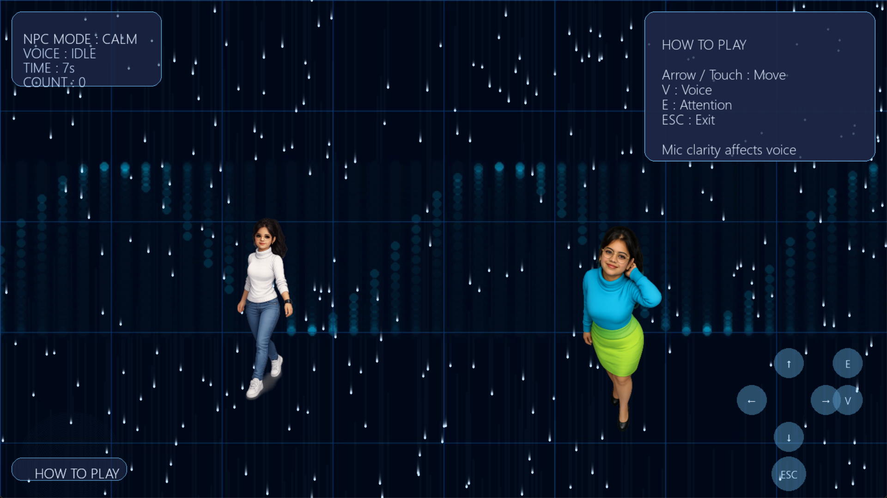
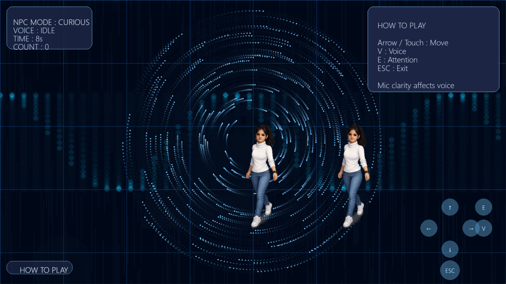
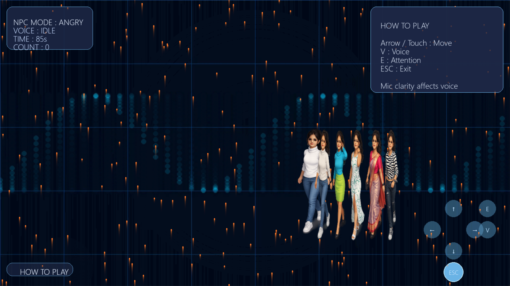

# AI Voice Interactive Game (Python)

An interactive desktop game built using Python that features an AI-powered NPC,
voice interaction, animated UI, and immersive visual effects.

## Features
- Player & NPC interaction
- Voice commands using microphone
- Text-to-speech NPC responses
- Animated characters & background
- Keyboard and mouse controls
- Fullscreen cinematic UI

##  Technologies Used
- Python
- Pygame
- OpenCV
- SpeechRecognition
- pyttsx3

##  How to Run Locally

pip install pygame opencv-python SpeechRecognition pyttsx3 pyaudio  
python game.py

##  Controls
- Arrow Keys → Move Player  
- V → Speak to NPC  
- E → Get NPC attention  
- ESC → Exit Game  

##  Screenshots

##  Author
Dhaneswari Behera
